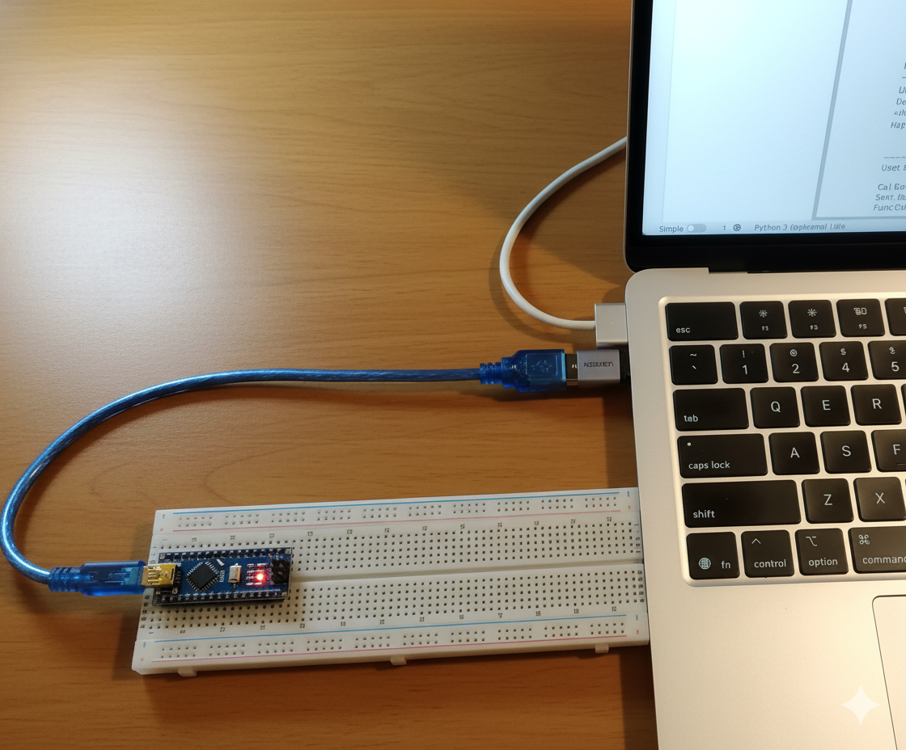

# Connect Ai to the Physical World with Arduino

The attached notebook and Arduino code is a simple example that shows how to connect Python code running in a local Jupyter Notebook to an Arduino. This setup gives a user the ability to tell AI chat agents to take actions in the real world e.g. switch on a light. The agent executes the user's natural language instructions by making function calls (tool calls) to the Arduino.

This beginner-friendly example will help you quickly grasp the fundamentals of connecting AI to the physical world. 

<br>


<p>Arduino Nano</p>

<br>


Please run the notebook locally, on your machine - not via Colab or Kaggle. You can use uv to launch Jupyter Lab locally:

```
# Downloads JupyterLab and launches it (Mac)
uv run --with jupyter jupyter lab
```

<br>

## How It Works

*   **The Connection:** The Python code in the Jupyter Notebook uses the `pyserial` library to connect to the Arduino through the computer's USB port. This communication happens over a standard protocol called **Serial**.

*   **The Configuration:** For the connection to succeed, two parameters must be configured correctly in the Python script:
    *   **The Port:** The name of the port your Arduino is connected to (e.g., `COM3` on Windows or `/dev/ttyUSB0` on Linux/Mac).
    *   **The Baud Rate:** The speed of communication. This rate **must be identical** in both the Python script and the Arduino sketch (e.g., `9600`).

*   **The Arduino's Role:** The code on the Arduino runs continuously in its `loop()` function. It can be programmed to do one of two things:
    *   **Send Data:** Send information (like sensor readings) over the serial port for Python to read.
    *   **Listen for Data:** Wait for a command to be sent from the Jupyter Notebook, and then take action based on that command (like turning an LED on or off, or sending back a sensor reading).
 
<br>

## Example Use Cases

The included Jupyter Notebook (`example.ipynb`) provides two examples:

*   **1. Simple Digital Control: Turn an LED On and Off**
    *   Send a simple command from the Jupyter Notebook to make the Arduino perform a physical action. This example uses the builtin LED on the Arduino therefore, you don't need to do any wiring.

*   **2. Control Arduino with the Gemini LLM**
    *   Use a Large Language Model (LLM) to interact with the Arduino using natural language. By chatting with Gemini and using function calling, you can type commands like "Please turn on the light." The model will translate your request into code that controls the Arduino. 

<br>

## Required Hardware

- Ardunio (Uno, Nano or similar) with USB cable

<br>

## The Arduino Auto Resets After Each Instruction

Most Arduino boards (like the Uno, Nano, and Mega) are designed to automatically reset whenever a new serial connection is opened from a computer. This feature allows the Arduino IDE to easily upload new code without needing to press the physical reset button. 

However, in an application, this causes unintended side effects. If you first ask the LLM to turn on the LED, it will execute your instruction. If you then ask the LLM to switch the LED off - you'll see that the LED turns off. However, the LED will be switched off because the board resets - not because the Arduino executed your instruction. 

The way to solve this is to physically disable the auto-reset feature on the Arduino. This allows the Python script to open and close connections without restarting the board, preserving the state of the LED. Auto-reset can be disabled by adding a 10uF capacitor between the RESET and GND pins on your Arduino - negative connected to GND and positive connected to RESET. This capacitor will need to be removed before a new skecth is uploaded to the Arduino, and then reinstalled when the upload is completed.

<br>

## Get started with electronics

The logical nature of electronics is very similar to coding. Therefore, if you enjoy coding the chances are that you'll also enjoy electronics. The most important thing is to have the right teacher. These are the two Udemy courses that I took to get started. 

- Electricity & electronics - Robotics, learn by building<br>
(Udemy electronics course)<br>
https://www.udemy.com/course/analog-electronics-robotics-learn-by-building/

- Digital Electronics: Robotics, learn by building module II<br>
(Udemy electronics course. I suggest skimming forward to module 34 (What is Arduino?))<br>
https://www.udemy.com/course/digital-electronics-robotics-learn-by-building-module-ii/

<br>

## Conclusion


This example is a framework for using a powerful computer as the "Brain" and the Arduino as the "Hands." Computers, like the Silicon Mac, are very powerful, but they have no direct way to "move" things in the real world or to "sense" the real world. This approach solves that problem. It combines the processing power of a Silicon Mac with the hardware control of the low-cost Arduino. Now your computer can act as a "Central Brain Server," controlling multiple Arduino "Minions."

<br>

